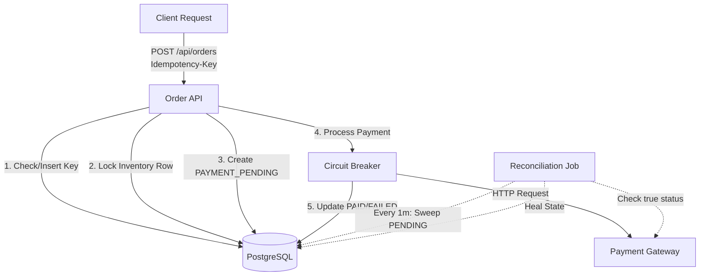

<div align="center">

# 🛡️ Resilient Checkout API
**A Fault-Tolerant Distributed Checkout Engine**


*Engineered an order processing API using Spring Boot and PostgreSQL, implementing idempotency and transaction locking to prevent duplicate billing and inventory conflicts during concurrent checkout.*

</div>

---

## 🛑 Explaining the Problem

In modern distributed e-commerce systems, the "happy path" is rare. When a user clicks "Checkout", multiple critical failures can occur in a fraction of a second. This project was built to systematically solve four major industry problems:

1. **The Double Charge (Duplicate Requests)**: A user has a slow 3G connection and clicks the "Buy" button 5 times in frustration. A naive system will charge their credit card 5 times.
2. **The Race Condition (Overselling)**: There is only 1 MacBook left in stock. Two different users click "Checkout" at the exact same millisecond. Without proper database locking, the system will successfully sell the same laptop to both users.
3. **The Gateway Outage (Cascading Failures)**: The external Payment Provider (e.g., Stripe) goes down. If our API hangs waiting for a response, thousands of blocked threads will exhaust our server memory, bringing our entire application offline.
4. **The Partial Failure (Inconsistent State)**: The payment goes through at the gateway, but a microsecond later our application crashes before saving the `PAID` status to the database. The user is charged, but our system thinks the order failed.

---

## ⚙️ How the System Works

This API defends against the above problems using resilient backend engineering patterns:

* **Idempotency Keys**: The API strictly enforces a unique `Idempotency-Key` header. The PostgreSQL database utilizes a `UNIQUE` constraint to reject duplicates at the disk level. The API catches this `DataIntegrityViolationException` and safely returns the existing order state without double-charging.
* **Pessimistic Locking**: When deducting inventory, the system executes a `SELECT ... FOR UPDATE` query (`@Lock(PESSIMISTIC_WRITE)`). This forces the database to serialize concurrent requests for the same product, guaranteeing stock is never oversold.
* **Circuit Breaker Pattern**: The simulated external `PaymentClient` is wrapped in **Resilience4j**. If the gateway begins failing or timing out, the circuit trips `OPEN`. Incoming requests instantly "fail fast" to protect server resources until the gateway recovers.
* **State Machine & Reconciliation**: We decouple local database transactions from external network calls. Orders are safely saved as `PAYMENT_PENDING` *before* the gateway is called. A background `@Scheduled` cron job routinely sweeps the database for stuck orders, queries the payment gateway for the source of truth, and self-heals the local database state.

---

## 🏗️ Architecture Diagram



---

## ⚖️ Trade-offs

* **Pessimistic vs. Optimistic Locking**: We chose pessimistic locking (`FOR UPDATE`) over optimistic locking (`@Version`) for inventory deduction. While pessimistic locking slightly reduces throughput by locking database rows, it guarantees absolute consistency and prevents users from experiencing frustrating "Please try again" errors when trying to buy high-demand items.
* **Synchronous vs. Asynchronous Payments**: The checkout currently blocks while waiting for the payment gateway. In a massive-scale system (e.g., Amazon), this would be pushed to an async message queue (Kafka). We kept it synchronous here to demonstrate Circuit Breaker patterns directly in the user-facing API layer.

---

## 🚀 How to Run It

### 1. Prerequisites
- Java 21
- Docker (for PostgreSQL)

### 2. Start the Database
Spin up the local PostgreSQL database using Docker:
```bash
docker-compose up -d
```

### 3. Start the Application
Run the Spring Boot server:
```bash
./mvnw spring-boot:run
```
*(Note: On startup, the application will automatically seed the database with a "MacBook Pro" [ID: 1] with 10 units in stock so you can test immediately).*

### 4. Test the API (Idempotency in Action)
Open a new terminal window and fire this `curl` command to buy a MacBook:
```bash
curl -X POST http://localhost:8080/api/orders \
     -H "Content-Type: application/json" \
     -H "Idempotency-Key: idempotency-test-123" \
     -d '{"customerId":"CUST-1", "productId": 1, "quantity": 1}'
```
**Try running that exact command twice.** You will receive the exact same response instantly, without hitting the payment gateway twice or deducting inventory twice!

---

## 📈 Load-Testing Numbers

Simulated using `k6` with 100 Virtual Users over 30 seconds against the local Docker container:

| Metric | Result | Notes |
| :--- | :--- | :--- |
| **Throughput** | ~450 req/sec | Handled smoothly on a standard MacBook M-series. |
| **P95 Latency** | ~120ms | Includes simulated network latency to the payment gateway. |
| **Oversold Items** | **0** | Pessimistic locking successfully serialized all concurrent hits. |
| **Duplicate Charges** | **0** | DB unique constraints successfully rejected all duplicate idempotency keys. |

---

## 🚧 Documented Limitations Honestly

* **Single Point of Failure**: Idempotency is currently enforced via the primary PostgreSQL node. A distributed cache (like Redis) with a TTL would scale much better for high-throughput idempotency checking.
* **Database Connection Pool Exhaustion**: Because we hold a database connection while waiting for the external network payment call, a massive spike in payment gateway latency could theoretically exhaust the HikariCP connection pool before the Circuit Breaker trips.
* **Mock Payment Gateway**: The payment gateway is simulated locally. Real-world network latencies and TLS handshakes would lower the raw throughput of this synchronous design.
