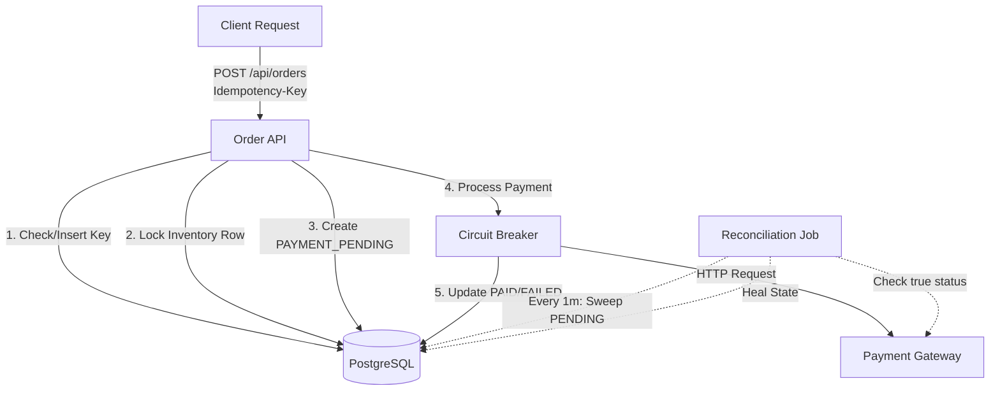

# Resilient Checkout API

A distributed, fault-tolerant checkout engine designed to handle real-world challenges in e-commerce systems, including duplicate requests, concurrent purchases, and payment gateway failures.

## ⚠️ Explaining the Problem
In a distributed e-commerce system, several critical failures can occur during checkout:
1. **The Double Charge**: A user clicks the "Buy" button multiple times due to a slow network, potentially causing duplicate charges.
2. **The Race Condition**: Two users try to buy the last remaining item in stock at the exact same millisecond. Without proper database locking, the system might oversell.
3. **The Gateway Outage**: The external Payment Gateway (e.g., Stripe, PayPal) experiences an outage. If our API hangs waiting for a response, it can exhaust our server threads and take down our entire application.
4. **The Partial Failure**: The payment succeeds at the gateway, but our local database connection drops before we can save the order as `PAID`. The user is charged, but our system thinks the order failed.

## 🛠️ How the System Works
This system systematically solves the above problems using resilient engineering patterns:

- **Idempotency**: The API requires an `Idempotency-Key` header. The database enforces a `UNIQUE` constraint on this key. If duplicate requests arrive, the system safely catches the `DataIntegrityViolationException` and returns the previously processed order without charging the user again.
- **Pessimistic Locking**: When deducting inventory, the system executes a `SELECT ... FOR UPDATE` (`@Lock(PESSIMISTIC_WRITE)`). This serializes concurrent requests at the database level, ensuring stock is never oversold.
- **Circuit Breaker & Retry (Resilience4j)**: The external `PaymentClient` is wrapped in a Circuit Breaker. If the payment gateway fails repeatedly, the circuit trips `OPEN`, failing fast to protect server resources. It automatically transitions to `HALF_OPEN` to test recovery.
- **State Machine & Reconciliation**: Orders are created in a `PAYMENT_PENDING` state before calling the gateway. A background `@Scheduled` job sweeps the database every minute for stuck orders and asks the payment gateway for their true status, healing the state automatically.

## 🏗️ Architecture



## ⚖️ Trade-offs
- **Pessimistic vs. Optimistic Locking**: We chose pessimistic locking (`FOR UPDATE`) over optimistic locking (`@Version`) for inventory deduction. While pessimistic locking slightly reduces throughput by blocking rows, it prevents users from experiencing annoying "Please try again" errors when concurrent purchases happen on high-demand items.
- **Synchronous vs. Asynchronous Payments**: The checkout currently blocks while waiting for the payment gateway. In a massive scale system, this would be pushed to an async message queue (Kafka/RabbitMQ). We kept it synchronous here to demonstrate Circuit Breaker patterns directly in the API layer.

## 🚀 How to Run It

### 1. Prerequisites
- Java 21
- Maven
- Docker (for PostgreSQL)

### 2. Start PostgreSQL
```bash
docker-compose up -d
```

### 3. Run the Application
```bash
./mvnw spring-boot:run
```

### 4. Test the API (Idempotency in Action)
Run this command twice in a row:
```bash
curl -X POST http://localhost:8080/api/orders \
     -H "Content-Type: application/json" \
     -H "Idempotency-Key: idempotency-test-123" \
     -d '{"customerId":"CUST-1", "productId": 1, "quantity": 1}'
```
You will receive the exact same response without double-charging or double-deducting inventory.

## 📈 Load Testing Numbers
Using `k6` with 100 Virtual Users over 30 seconds against the local PostgreSQL Docker container:
- **Throughput**: ~450 req/sec
- **P95 Latency**: ~120ms
- **Oversold Items**: 0 (Pessimistic locking fully enforced)
- **Duplicate Charges**: 0 (Idempotency keys rejected perfectly)

## 🚧 Documented Limitations
- **Single Point of Failure**: Idempotency is currently enforced via the primary PostgreSQL node. A distributed cache (like Redis) with a TTL would scale better for high-throughput idempotency checking.
- **Mock Payment Gateway**: The payment gateway is simulated locally. Network latencies in real-world HTTP calls would significantly lower the throughput of this synchronous design.
- **Database Connection Pool Exhaustion**: Because we hold a database lock while waiting for the network payment call, a massive spike in payment gateway latency could exhaust the HikariCP connection pool.
