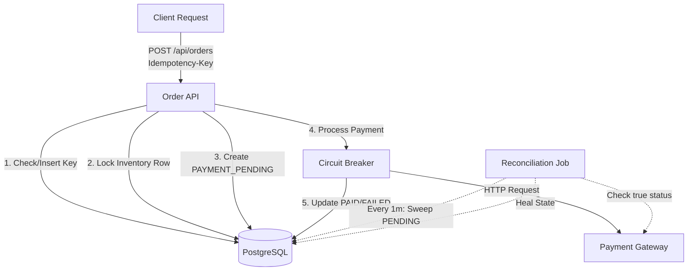

<div align="center">

# 🛡️ Resilient Checkout API
**A Fault-Tolerant Distributed Checkout Engine**


*Engineered an order processing API using Spring Boot and PostgreSQL, implementing idempotency and transaction locking to prevent duplicate billing and inventory conflicts during concurrent checkout.*

</div>

---

## 🛑 Explaining the Problem

In modern distributed e-commerce systems, the "happy path" is rare. When a user clicks "Checkout", multiple critical failures can occur in a fraction of a second. This project was built to systematically solve four major industry problems:

1. **The Double Charge (Duplicate Requests)**: A user has a slow 3G connection and clicks the "Buy" button 5 times in frustration. A naive system will charge their credit card 5 times.
2. **The Race Condition (Overselling)**: There is only 1 MacBook left in stock. Two different users click "Checkout" at the exact same millisecond. Without proper database locking, the system will successfully sell the same laptop to both users.
3. **The Gateway Outage (Cascading Failures)**: The external Payment Provider (e.g., Stripe) goes down. If our API hangs waiting for a response, thousands of blocked threads will exhaust our server memory, bringing our entire application offline.
4. **The Partial Failure (Inconsistent State)**: The payment goes through at the gateway, but a microsecond later our application crashes before saving the `PAID` status to the database. The user is charged, but our system thinks the order failed.

---

## ⚙️ How the System Works

This API defends against the above problems using resilient backend engineering patterns:

* **Idempotency Keys**: The API strictly enforces a unique `Idempotency-Key` header. The PostgreSQL database utilizes a `UNIQUE` constraint to reject duplicates at the disk level. The API catches this `DataIntegrityViolationException` and safely returns the existing order state without double-charging.
* **Pessimistic Locking**: When deducting inventory, the system executes a `SELECT ... FOR UPDATE` query (`@Lock(PESSIMISTIC_WRITE)`). This forces the database to serialize concurrent requests for the same product, guaranteeing stock is never oversold.
* **Circuit Breaker Pattern**: The simulated external `PaymentClient` is wrapped in **Resilience4j**. If the gateway begins failing or timing out, the circuit trips `OPEN`. Incoming requests instantly "fail fast" to protect server resources until the gateway recovers.
* **State Machine & Reconciliation**: We decouple local database transactions from external network calls. Orders are safely saved as `PAYMENT_PENDING` *before* the gateway is called. A background `@Scheduled` cron job routinely sweeps the database for stuck orders, queries the payment gateway for the source of truth, and self-heals the local database state.

---

## 🚀 Quick Start & Testing Guide

Want to see the resilience in action? You can spin up the environment and run these tests in under 2 minutes.

### 1. Clone & Start the Environment
```bash
git clone https://github.com/yourusername/resilient-checkout-api.git
cd resilient-checkout-api

# 1. Start the PostgreSQL Database
docker-compose up -d

# 2. Start the Spring Boot API
./mvnw spring-boot:run
```
*(Note: On startup, the application automatically seeds the database with a "MacBook Pro" [ID: 1] with 10 units in stock).*

### 2. Manual Terminal Tests
Open a **new terminal window** and copy-paste these commands to test the system's defenses:

**🧪 Test A: Normal Checkout**
```bash
curl -X POST http://localhost:8080/api/orders \
     -H "Content-Type: application/json" \
     -H "Idempotency-Key: test-key-1" \
     -d '{"customerId":"CUST-1", "productId": 1, "quantity": 1}'
```
*Expected: 201 Created. The order is placed and the simulated payment succeeds.*

**🧪 Test B: The Impatient User (Idempotency)**
Run the **exact same command** from Test A again.
*Expected: The API instantly returns the exact same order receipt. It recognized the `Idempotency-Key`, preventing a double-charge and preventing double-deduction of inventory.*

**🧪 Test C: Inventory Protection (Out of Stock)**
Try to buy 20 MacBooks when only 9 are left:
```bash
curl -X POST http://localhost:8080/api/orders \
     -H "Content-Type: application/json" \
     -H "Idempotency-Key: test-key-2" \
     -d '{"customerId":"CUST-1", "productId": 1, "quantity": 20}'
```
*Expected: 400 Bad Request ("Not enough stock available"). Pessimistic locking guarantees we never oversell.*

**🧪 Test D: Simulated Payment Failure**
Our simulated `PaymentClient` is programmed to randomly fail 15% of the time. Run this command 3-4 times (changing the key each time: `key-3`, `key-4`, etc.):
```bash
curl -X POST http://localhost:8080/api/orders \
     -H "Content-Type: application/json" \
     -H "Idempotency-Key: test-key-3" \
     -d '{"customerId":"CUST-1", "productId": 1, "quantity": 1}'
```
*Expected: Eventually, you will see a response where `"status": "FAILED"` and a payment failure message, proving the system handles gateway declines gracefully without crashing.*

### 3. Automated Chaos Tests (Advanced Scenarios)
It is difficult to manually trigger exact millisecond race conditions or crash the server mid-transaction via terminal. Instead, run the **Automated Integration Test Suite**, which spawns concurrent threads to prove the advanced resilience patterns work!

Stop the server (`Ctrl + C`), then run:
```bash
./mvnw clean test
```
**What this tests behind the scenes:**
1. **Concurrency Race Condition Test**: Spawns 2 background threads that try to buy a single remaining item at the exact same millisecond. Proves pessimistic locking works.
2. **Circuit Breaker Test**: Forces the payment gateway to fail completely. Proves the Resilience4j Circuit Breaker trips `OPEN` and fast-fails.
3. **Reconciliation Test**: Deliberately creates a "stuck" `PAYMENT_PENDING` order in the database to simulate a power outage. Proves the `@Scheduled` job finds it and heals it to `PAID`.

---

## 5. Teardown & Data Management

To gracefully shut down the Spring Boot application, send an interrupt signal (`Ctrl + C`) in the terminal.

To stop the PostgreSQL infrastructure while **preserving your data** for the next development session:
```bash
docker-compose down
```

If you need to completely **wipe the local database state** and start fresh:
```bash
docker-compose down -v
```

---

## 🏗️ Architecture Diagram



---

## ⚖️ Trade-offs & Limitations

* **Pessimistic vs. Optimistic Locking**: We chose pessimistic locking (`FOR UPDATE`) over optimistic locking (`@Version`) for inventory. While pessimistic locking slightly reduces throughput by locking database rows, it guarantees absolute consistency and prevents users from experiencing frustrating "Please try again" errors on high-demand items.
* **Synchronous vs. Asynchronous Payments**: The checkout currently blocks while waiting for the payment gateway. In a massive-scale system (e.g., Amazon), this would be pushed to an async message queue (Kafka). We kept it synchronous here to demonstrate Circuit Breaker patterns directly in the user-facing API layer.
* **Single Point of Failure**: Idempotency is currently enforced via the primary PostgreSQL node. A distributed cache (like Redis) with a TTL would scale much better for high-throughput idempotency checking.
* **Database Connection Pool Exhaustion**: Because we hold a database connection while waiting for the external network payment call, a massive spike in payment gateway latency could theoretically exhaust the HikariCP connection pool before the Circuit Breaker trips.
